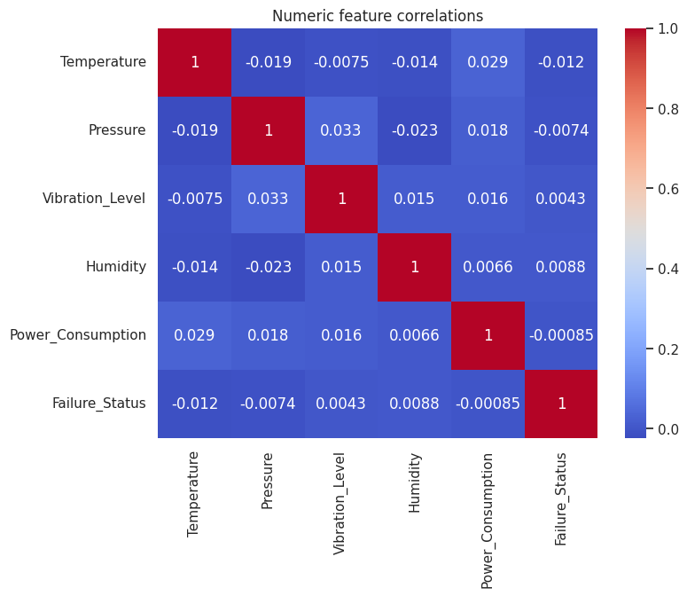
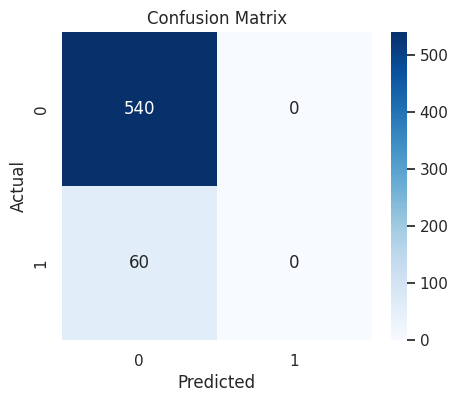

# SmartOps Insight – Machine Condition Monitoring & Failure Prediction

SmartOps Insight is a real-time machine health monitoring system designed for factories and industries to continuously track the condition of their running machines. Using sensor data, the system predicts potential machine failures and helps in proactive maintenance to ensure efficient operations.

## 🔹 Features

- 🚀 **Real-time machine health prediction** using key parameters:
  - Temperature 🌡️
  - Pressure ⏱️
  - Vibration 🌊
  - Humidity 💧
  - Power Consumption ⚡
  - Hour of Day ⏰
- 📊 Interactive web interface built with **Python Flask** and **Tailwind CSS**
- 🖱️ Simple input fields to feed data and check machine health instantly
- 🌟 Failure probability visualization with status indicators (Good ✅, Warning ⚠️, Bad ❌)

## 🛠️ Technologies Used

- **Machine Learning:** Random Forest algorithm
- **Frontend:** HTML + Tailwind CSS
- **Backend:** Python Flask
- **Environment:** Google Colab (for training ML model)
- **Dataset:** Kaggle dataset

## 📈 How It Works

1. Collect real-time sensor data from machines in a factory or industrial environment
2. Input the sensor data into the web form
3. The system predicts the health status of the machine using the trained Random Forest model
4. The web interface displays the machine's health status along with failure probability
5. Factories can use this information for proactive maintenance to avoid unexpected downtimes

## 🚀 Getting Started

### Prerequisites

- Python 3.7 or higher
- Flask
- Required Python packages (see requirements.txt)

### Installation

1. Clone the repository:
   ```bash
   git clone https://github.com/yourusername/smartops-insight.git
   ```

2. Navigate to the project folder:
   ```bash
   cd smartopsinsight
   ```

3. Install dependencies:
   ```bash
   pip install -r requirements.txt
   ```

4. Run the Flask application:
   ```bash
   python app.py
   ```

5. Open your browser and access:
   ```
   http://127.0.0.1:5000
   ```

6. Enter sensor data in the input fields and check machine health in real-time

## 📚 Project Structure

```
smartops-insight/
│
├── templates/
│   └── index.html              # Main web interface
├── app.py                      # Flask backend application
├── machine_health_model.pkl    # Trained Random Forest model
├── scaler.pkl                  # Data preprocessing scaler
├── requirements.txt            # Python dependencies
└── README.md                   # Project documentation
```

## 💡 Usage

1. Launch the web application using the installation steps above
2. Enter the following sensor parameters:
   - **Temperature**: Machine operating temperature
   - **Pressure**: System pressure readings
   - **Vibration**: Vibration levels
   - **Humidity**: Environmental humidity
   - **Power Consumption**: Current power usage
   - **Hour of Day**: Time of operation (0-23)
3. Click "Predict" to get the machine health status
4. View the results with color-coded status indicators

## 🤖 Key Learnings

- Applied **Random Forest** algorithm for predictive maintenance
- Learned to integrate **ML models** into web applications
- Explored **real-time data visualization** using Tailwind CSS
- Understood the importance of **Industry 4.0** technologies in manufacturing

## ⚡ Future Improvements

- [ ] Connect to actual IoT sensors for real-time data streaming
- [ ] Add user authentication & dashboard for multiple machines
- [ ] Explore more advanced ML models for better prediction accuracy
- [ ] Deploy on cloud platforms for 24/7 monitoring
- [ ] Implement historical data analysis and trending
- [ ] Add email/SMS alerts for critical machine conditions

## 📊 Model Performance

The Random Forest model was trained on industrial sensor data and achieves:
- **Accuracy: 90%** (0.9)

### Model Evaluation Visualizations

#### Confusion Matrix


#### Correlation Matrix


*These visualizations provide insights into model performance and feature relationships in the dataset.*

## 📝 License

This project is licensed under the MIT License - see the [LICENSE](LICENSE) file for details.
